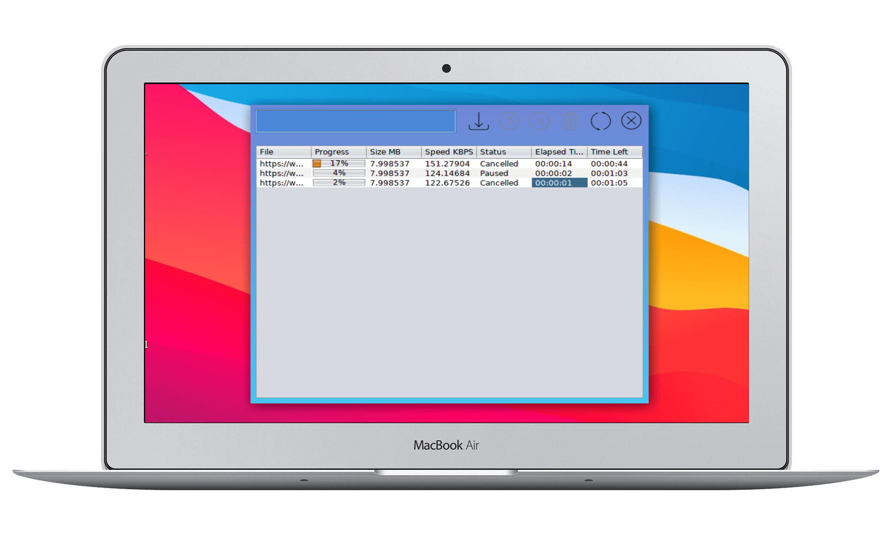

## JDM (Java Download Manager)

[](https://sourceforge.net/projects/java-download-manager/files/latest/download)


[](https://sourceforge.net/projects/java-download-manager/files/latest/download)




## To Build
- ``` mvn clean package ```

## To Run
- ``` /target/JDM-0.1.0-jar-with-dependencies.jar ```